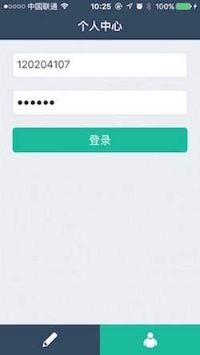

# 数字签到系统——学生端

## 项目简介

一个iOS端的课堂签到系统学生端，和教师端一起配合使用，主要功能有学生个人中心的登录、扫描并识别课程二维码。

> 这是自己大学自学了Objective-C后写的第一个完整的项目（其实只是个Demo。。），同时也是自己毕业设计的作品，虽然代码质量比较低，项目里面的API自己也没有维护，所以基本应该用不了，之后应该也不会再更新，但对自己有一定意义，所以在Github上托管予以保留，代码片段如有需要可以随意使用。。

## 如何运行

1. 双击 `数字签到系统.xcodeproj` 文件

2. 模拟器选择 `iPhone`

3. `Command + R` 运行

## 应用截图

## 另一个对应的APP

教师端客户端请点链接：[sign-in-teacher](https://github.com/onee-io/sign-in-teacher)
